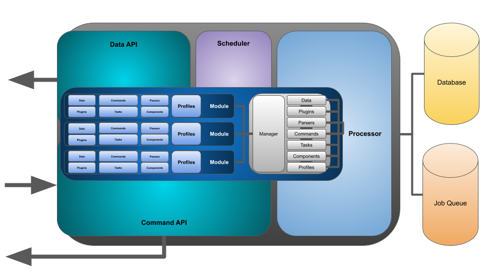

  

| Branch       | CircleCI Status   |
| :---------   | :-----------------|
| **Master**  |  |

 

# Zimagi overview

**Open Source Distributed Data Processing Platform**

Zimagi is a fast and powerful open source distributed data processing platform that empowers developers to implement powerful production-ready data pipelines with less code.

 

## The Goal

Make it fast and easy to create powerful, scalable production ready APIs and distributed data processing services:

* Ready for our data
* In minutes or hours, not weeks, months, or years
* At a fraction of the cost of traditional development services or proprietary API platforms
* That are completely extensible and customizable, built on popular open source software

In short; **Go from concept and architecture to production data services in no time with little to no code**

 

## Major Features

* Modular database driven API and processing platform built on Python, Django, Celery, and other popular open source technologies
* Auto-generated code base from architectural specifications _(production ready data, imports, and APIs with little or no code required)_
* Hosted API and / or CLI _(no server required to use or get started)_
* Micro-service APIs out of the box:
    * Secure and flexible streaming RPC command API for data updates and system management
    * Fast and secure OpenAPI compatible REST API for searchable data access
* Pluggable architecture for extreme extensibility with version controlled modules
* Powerful, layered data centric orchestration language with query capabilities for advanced data processing workflows across clusters of machines
* Multi user role based management and access with command logging and auditing
* Strong encryption of sensitive data including platform state, configurations, and customizable fields _(communications and database backups are safe)_
* Integrated real-time, queued, and scheduled command execution
* Configurable user email notifications on command execution and failure

 

# Architecture

The Zimagi platform is composed of four Dockerized micro-services that each collaboratively perform vital services to ingesting, processing, and distributing data through the system.

  

These include:

## Command API

The command API service provides a streaming RPC "remote operating system" for performing actions through the platform.  Commands each have their own endpoints in a command tree and accepted POSTed parameters and return a series of JSON messages back to the client as they are executing.

It is possible to create commands that terminate when the client breaks the connection or continue processing until done regardless if the user is still connected.  It is also possible to push command executions to a backend queue for worker processing, or schedule them to run at intervals or a certain date and time.

_Command API services can easily scale across cluster nodes with demand_

## Data API

The data API service provides an OpenAPI compatible REST data access system that allows for easy querying and downloading of data in JSON form.

The data API can currently return lists of data objects that can be searched across nested relationships with special GET parameters and it can return single data objects specified with an instance key.

_Data API services can easily scale across cluster nodes with demand_

## Scheduler

The scheduler service provides the ability to schedule commands that are queued and workers then run on a particular date and time or during regular intervals.

There are three modes of scheduling in the system:

* Run a command at a specific date and time _(ex; **Dec 25th, 2020**)_
* Run a command at an interval _(ex; **every hour**)_
* Run a command according to a crontab spec _(format; **Month Hour DayOfMonth MonthOfYear DayOfWeek**)_

_Scheduler services can run across cluster nodes for high availability, but only a single scheduler is active at a given time_

## Worker

The worker service provides a queued execution ability of commands in the background that are logged in the system, just like commands executed in real-time.

Workers pull tasks from a central Redis queue and process in a first come basis until all command jobs are completed.  This gives us the ability to easily distribute data processing processes across a small or large number of processors, giving us an easily parallel execution environment that can reduce the time to complete larger data driven tasks.

_Worker services can easily scale across cluster nodes with demand_

## Background Data Services

The Zimagi platform requires two data stored running in the background to operate.  These allow Zimagi to store and access persistent data across cluster nodes and store and process parallel jobs

### Relational Database

A relational database is required to define, store, and access data models.  So far **SQLLite3**, **PostgreSQL**, and **MySQL variants** are supported.

### Job Queue

A Redis queue is required to store and retrieve background commands to execute by worker nodes.  Both the **command API** and the **scheduler** add jobs to this queue.

  

  

 

# Getting Started